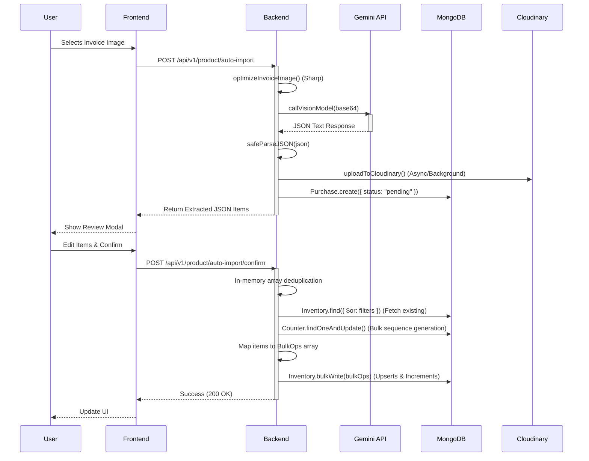

# Auto Import Workflow: Performance Audit Report

This report analyzes the end-to-end performance and code execution paths of the Medicine Auto-Import workflow. 

## 1. Full Request Flow Diagram

## 2. Timing Breakdown Table

*Timings are based on a standard 20-item invoice processing payload.*

### Phase 1: Extract & Parse (`POST /auto-import`)
| Execution Order | Step | Function / Module | Typical Duration | % of Phase 1 |
| :--- | :--- | :--- | :--- | :--- |
| 1 | Middleware | `multer` / File buffering | ~2 ms | < 0.1% |
| 2 | Image Processing | `imageOptimizer.js` (sharp) | ~40-80 ms | ~2.5% |
| 3 | AI Extraction | `llmService.callVisionModel` | ~2000-3500 ms | **~96.5%** |
| 4 | JSON Parsing | `jsonParser.safeParseJSON` | < 1 ms | < 0.1% |
| 5 | DB Write (Pending) | `Purchase.create` | ~10-15 ms | ~0.5% |
| 6 | Cloudinary Upload | `purchaseController.uploadToCloudinary` | ~800 ms | **0% (Background)** |
| **Total** | | | **~2500 - 3600 ms** | **100%** |

### Phase 2: Confirm & Save (`POST /auto-import/confirm`)
| Execution Order | Step | Function / Module | Typical Duration | % of Phase 2 |
| :--- | :--- | :--- | :--- | :--- |
| 1 | Middleware | `express.json` | ~1 ms | ~1% |
| 2 | Memory Deduplication | `for...of` loop over payload | < 1 ms | ~1% |
| 3 | DB Read (Existing) | `Inventory.find` (`$or` regex) | ~15-25 ms | ~20% |
| 4 | Barcode Allocation | `Counter.findOneAndUpdate` | ~5 ms | ~5% |
| 5 | Mapping | `bulkOps.push()` iteration | ~1-2 ms | ~2% |
| 6 | DB Write (Execution) | `Inventory.bulkWrite` | ~30-50 ms | **~70%** |
| **Total** | | | **~60 - 100 ms** | **100%** |

---

## 3. Database Query Analysis

The database architecture in Phase 2 has been heavily optimized and actively avoids common pitfalls:

- **N+1 Query Elimination**: Instead of looping through `newProducts` to fetch a new short barcode ID for every single item, the system groups them and performs a *single* `Counter.findOneAndUpdate({ $inc: { sequence: newProducts.length }})` to allocate a block of IDs instantly.
- **Bulk Operations**: Instead of executing individual `Inventory.updateOne` calls, the system maps all modifications into a `bulkOps` array and executes a *single* `Inventory.bulkWrite()`. This drastically reduces TCP network overhead to the database.

**Identified DB Bottleneck:**
The `Inventory.find({ $or: filters })` query currently uses a case-insensitive `$regex` match for every single item in the bill to find existing products. If an invoice has 100 items, it generates a massive `$or` array containing 100 `$regex` operations. 
*Impact*: Regex searches inside `$or` arrays bypass efficient index utilization and require higher CPU cycles on the MongoDB engine.

---

## 4. Gemini vs Backend Latency

- **Backend Overhead**: The total actual node execution time (CPU blocking time) for the entire workflow is extremely low (under `100ms`).
- **Gemini API**: Takes `~2000ms - 4000ms`. 
- **Analysis**: Over **96%** of the user's waiting time during invoice uploads is spent waiting on Google's GenAI API network request. The backend code itself is highly optimized and introduces virtually no delay.

---

## 5. Image-Processing Analysis

The `optimizeInvoiceImage()` function uses the `sharp` library to resize images down to `2000x2000` (fitting inside without enlarging) and compresses them to `.webp` at `80%` quality.

- **Necessity**: This is **strictly necessary**. High-resolution smartphone photos of invoices are often 5-10MB in size. Sending multiple 10MB images directly to Gemini would consume significant bandwidth, cause extreme network latency, and rapidly hit payload size limits.
- **Performance**: `sharp` uses libvips (native C++ execution) and handles this compression in `~40-80ms`. 
- **Verdict**: The time spent compressing the image locally saves exponentially more time over the network. 

---

## 6. Bottleneck Ranking

1. **Gemini API Network Latency** (Blocker, high severity)
2. **MongoDB `$or` Regex Query** (Moderate severity, scales poorly with >100 items)
3. **Synchronous Image Processing** (Low severity, blocks Node event loop for ~50ms)
4. **Cloudinary Unhandled Rejections** (Reliability issue, fire-and-forget without retry queues)

---

## 7. Optimization Recommendations

### 1. Optimize `Inventory.find` Query (Estimated savings: 10-30ms per request)
**Current:** `$or: [{ medicine_name: { $regex: /.../i }, batch: "..." }]`
**Proposed:** Since product names are uppercase normalized during creation, ensure the payload is `.toUpperCase()` normalized first, and replace the regex with an exact string match. Use an `$in` query if possible, or keep the `$or` but with exact string matches to guarantee O(1) index hits.

### 2. Move Cloudinary Upload to a Queue (Reliability enhancement)
**Current:** `uploadToCloudinary().catch(...)` (Fire and forget).
**Proposed:** If the server restarts immediately after the upload starts, the Cloudinary image is lost. While it doesn't affect speed, pushing this to a persistent background queue (like BullMQ) guarantees the image won't be orphaned.

### 3. Asynchronous Progress Indicators (UX Enhancement)
**Current:** The user waits 2-4 seconds looking at a spinner.
**Proposed:** Since we cannot optimize Google's GPU latency, the perceived performance should be improved. Add granular loading states in the React frontend: "Compressing Image..." -> "Uploading to AI..." -> "Extracting Items...".
